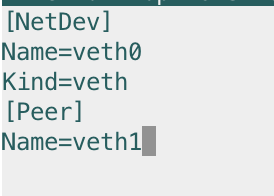
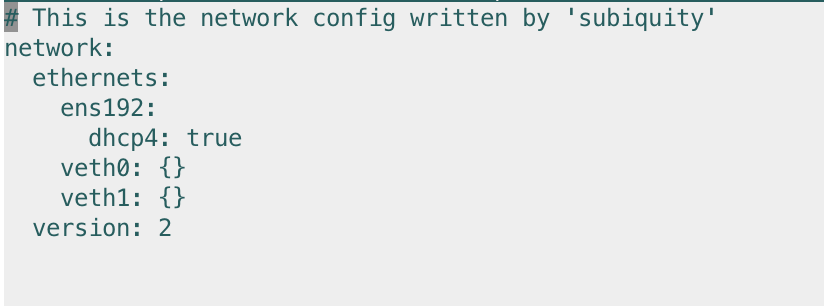
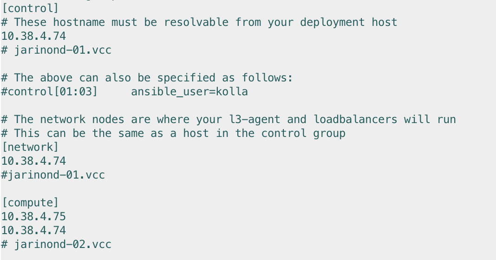
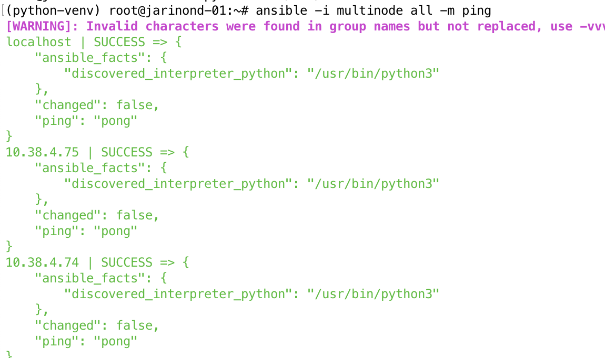
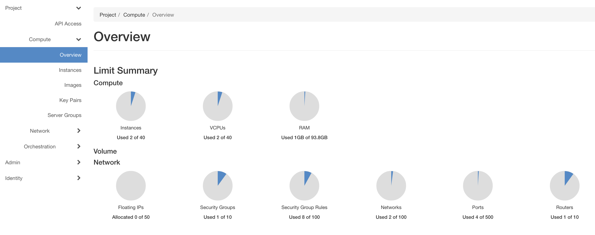
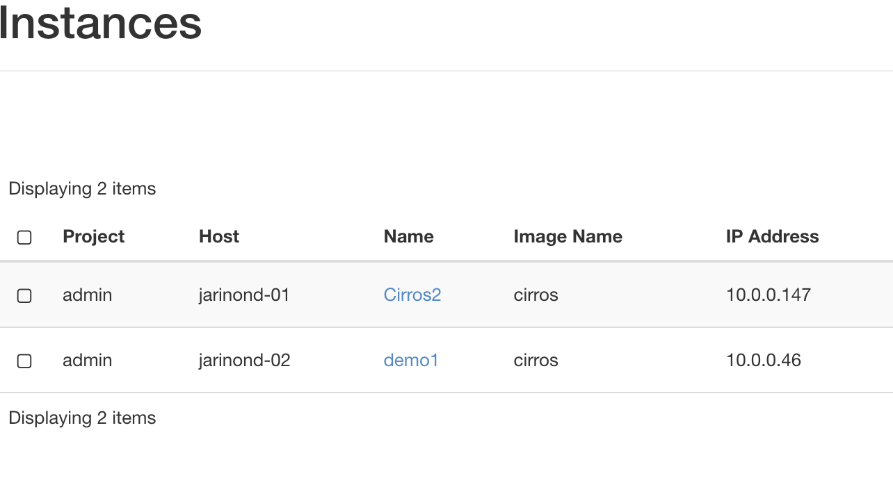
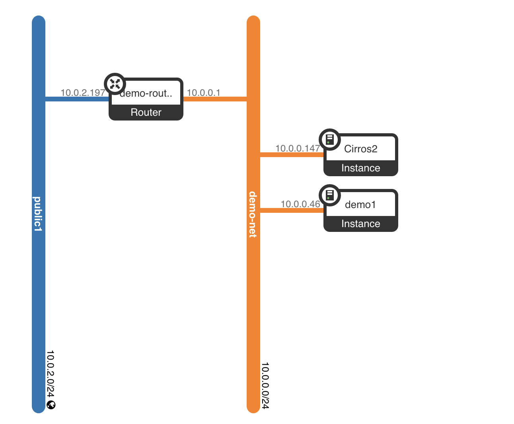
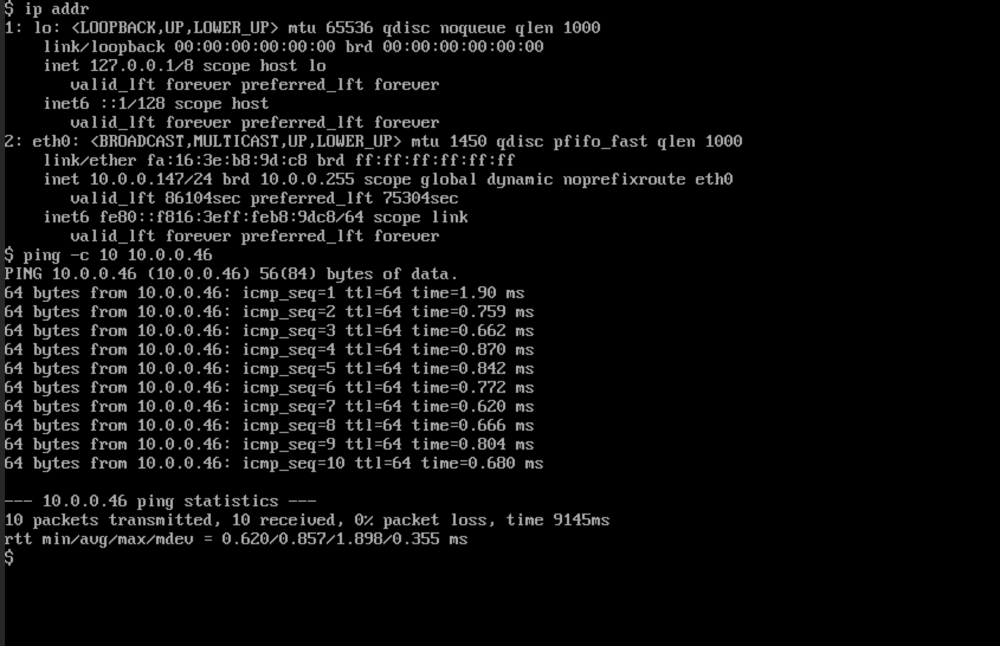
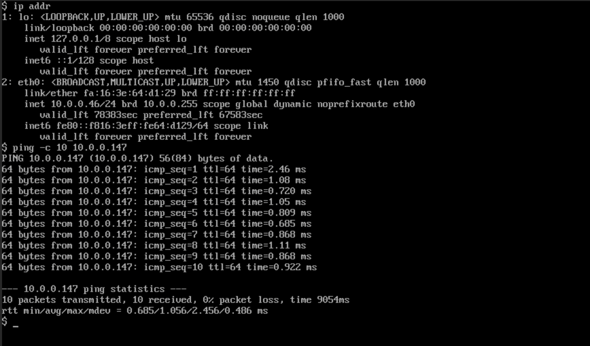
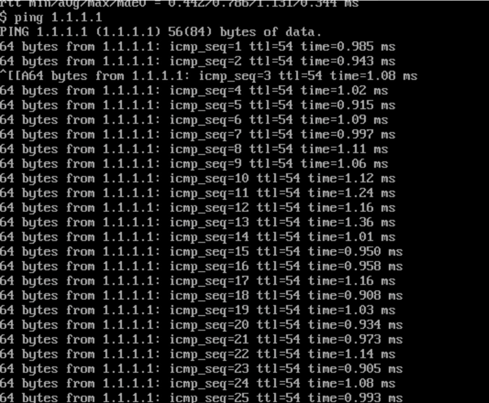

# NI-VCC Úloha 1

### Nasadenie OpenStacku
Pri nasadení OpenStacku som postupoval hlavne podľa návodu v [dokumentácii OpenStacku](https://docs.openstack.org/kolla-ansible/zed/user/quickstart.html).
#### 1. Nainštaloval som potrebné packages a vytvoril virtuálne prostredie
```
sudo apt update
sudo apt upgrade
sudo apt install python3-venv
python3 -m venv python-venv
source python-venv/bin/activate
pip install -U pip
```

#### 2. Nainštaloval som ansible a kolla-ansible a nastavil ich

```
pip install 'ansible>=4,<6'
pip install git+https://opendev.org/openstack/kolla-ansible@stable/zed

sudo mkdir -p /etc/kolla
sudo chown $USER:$USER /etc/kolla

cp -r python-venv/share/kolla-ansible/etc_examples/kolla/* /etc/kolla

cp python-venv/share/kolla-ansible/ansible/inventory/* .

kolla-ansible install-deps
```

#### 3. Vytvorenie veth pairu
Na oboch VM vytvoríme veth pair nasledovne:
`emacs /etc/systemd/network/25-veth-b1b2.netdev`


`emacs /etc/netplan/00-installer-config.yaml`


#### 4. Konfigurácia multinode

Ako control node je nastavená 1. VM (jarinond-01) s ip adresou `10.38.4.74`.
Network node je tiež jarinond-01.
Compute nodes sú obe VM (jarinond-01 a jarinond-02). Ich IP adresy sú `10.38.4.74 a 10.38.4.75`
Môžeme tak spúšťať VM na oboch uzloch.
Môžeme overiť, že multinode ping funguje.


#### 5. Upravíme kolla-globals podľa návodu
```
emacs /etc/kolla/globals.yml
```
#### 6. Deployment
```
kolla-ansible -i ./multinode bootstrap-servers
kolla-ansible -i ./multinode prechecks
kolla-ansible -i ./multinode deploy
```

#### 7. Nainštalovanie OpenStack klienta
```
pip install python-openstackclient -c https://releases.openstack.org/constraints/upper/zed
kolla-ansible post-deploy
python-venv/share/kolla-ansible/init-runonce
```

Vidíme, že sa môžeme pripojiť do klienta a OpenStack je úspešne nasadený


### Inštancie VM
#### 1. Vytvoríme VM - na jednom uzle sa bude nachádzať vždy jedna inštancia.

Vytvoril som inštancie VM a pomenoval som icb demo1 a Cirros2.
```
openstack server create     --image cirros     --flavor m1.tiny     --key-name mykey     --network demo-net     demo1

openstack server create     --image cirros     --flavor m1.tiny     --key-name mykey     --network demo-net  --availability-zone nova:jarinond-01   Cirros2
```
V GUI vidíme, že každá má odlišný Host.


#### 2. Nastavenie siete

Obe inštancie sú v rovnakej sieti, čo môžeme otestovať pingom z jednej na druhú.



### Pripojenie VM na internet

#### 1. Veth pair
Koniec veth pairu veth1 je pripojený do openstacku. Aby packety mohli prechádzať z inštancií do uzla, nastavíme jeho IP adresu na gateway adresu routera.
`sudo ip addr add 10.0.2.1/24 dev veth1`
`sudo ip link set dev veth1 up`

#### 2. Iptables

`iptables -t nat -A POSTROUTING -s 10.0.2.1/24 -o ens192 -j MASQUERADE`
Po povolení routovania môžeme vidieť, že je možné sa pripojiť z VM na internet.
Otestujeme ping 1.1.1.1


