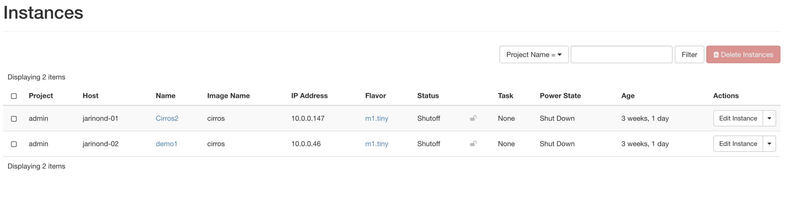
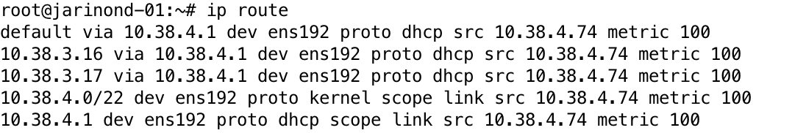

# NI-VCC Úloha 2
#### Ondrej Jarina, 2023

Z minulej úlohy máme nasadené 2 virtuálne stroje na rôznych hostiteľoch.

Pomocou príkazu `ip route` zistíme adresu DHCP servera na riadiacom uzle

Z virtuálneho stroja spustíme ping na DHCP server.

