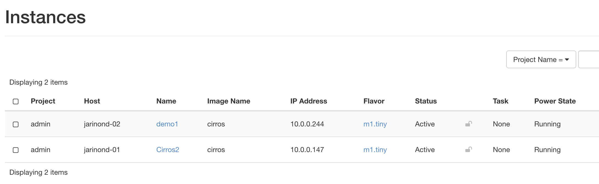
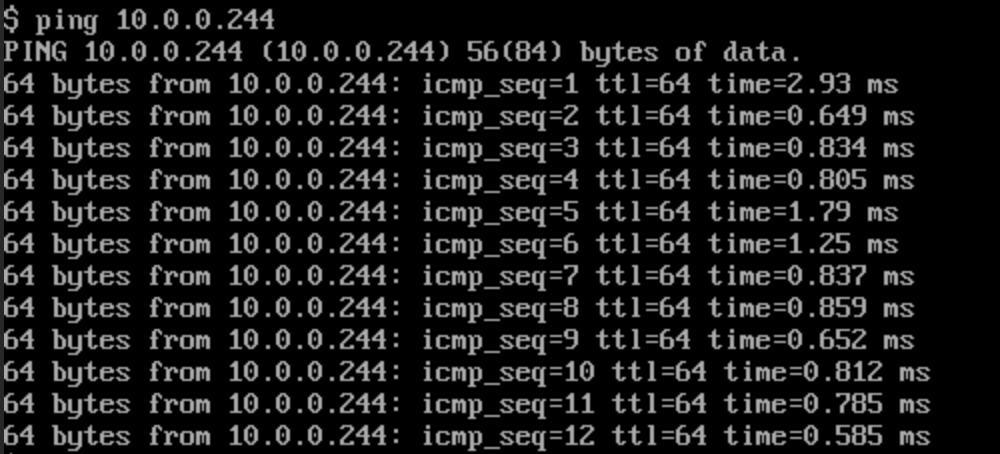
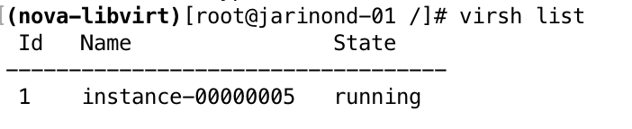
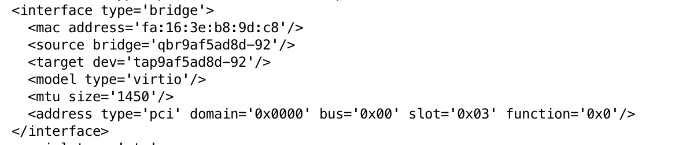
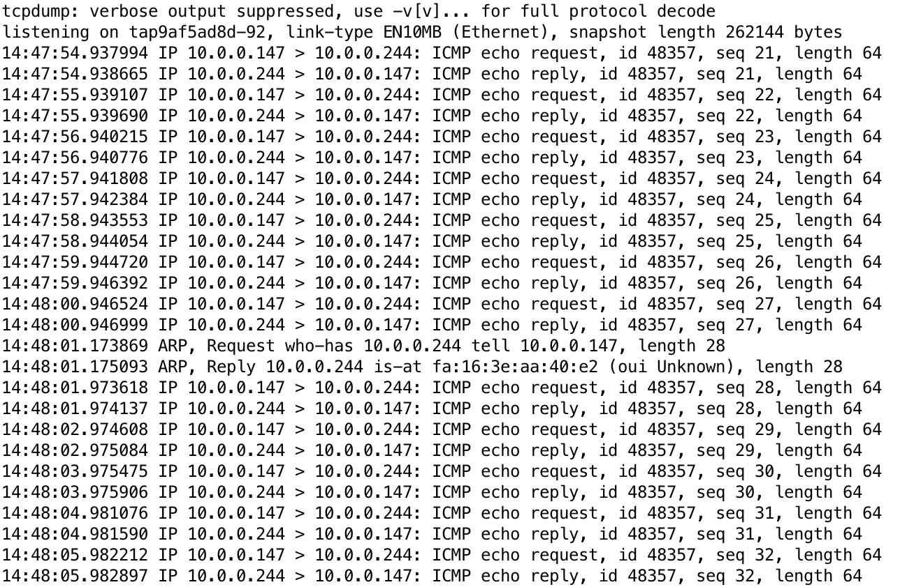
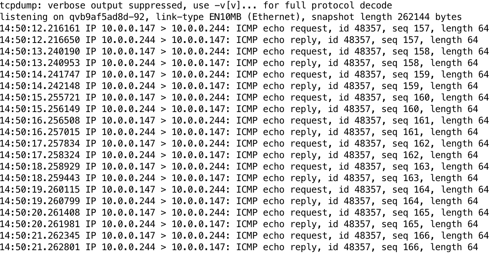
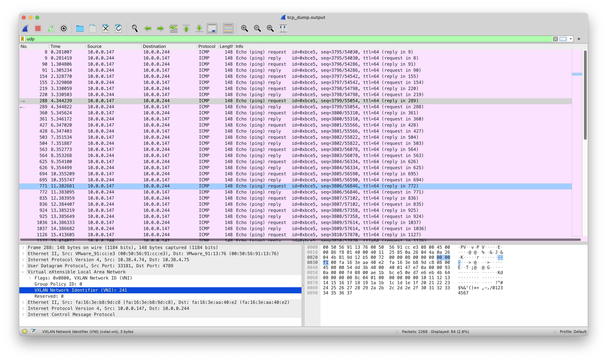

# NI-VCC Úloha 2
#### Ondrej Jarina, 2023

Podľa postupu z minulej úlohy nasadíme 2 virtuálne stroje na rôznych hostiteľoch.

Z virtuálneho stroja na uzle jarinond-01 spustíme ping na virtuálny stroj na uzle jarinond-02.

### XML deskriptor
XML deskriptor VM získame po vstúpení do konzoly kontajnera nova_libvirt príkazom `docker exec -it nova_libvirt bash -i`,
pomocou príkazu `virsh list` získame zoznam VM spustených na host uzle.

Inštancia má názov instance-0000005, jej XML deskriptor nájdeme teda na adrese `/etc/libvirt/qemu/instance-00000005.xml`. 
Príkazom `cat` zistíme jeho obsah.

* **názov tap rozhrania:** tap9af5ad8d-92
* **názov bridge rozhrania:** qbr9af5ad8d-92

### Trasovanie prevádzky pomocou tcpdump

Trasovanie prevádzky môžeme vykonať pomocou príkazu `tcpdump -i` na rozhraní `tap9af5ad8d-92`
Vidíme prechádzajúce packety pingu na dhcp server.

Ak chceme zistiť, či ping prechádza firewallom, trasujeme prevádzku na rozhraní qvb zo strany bridgeu, teda `qvb9af5ad8d-92`

### Trasovanie prevádzky VXLAN pomocou Wireshark
Trasovanie prevádzky tunela VXLAN medzi dvomi uzlami vykonáme znova pomocou príkazu `tcpdump`.
Trasovanie prebieha na fyzickom rozhraní, v tomto prípade `ens192`.

`tcpdump -i ens192 -s 65535 -vv -w tcp_dump.output`

