# NI-VCC Úloha 3
**Ondrej Jarina, 2023**

## Vytvorenie docker image
Na vytvorenie docker image som použil node js server aplikáciu (úloha z predmetu NI-AM2).

Použitý dockerfile:

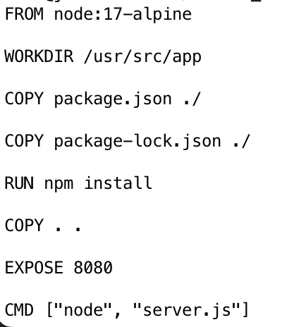

`docker build --network host -t docker_app .`


Že sa obraz skutočne vytvoril skontrolujeme príkazom `docker image list`

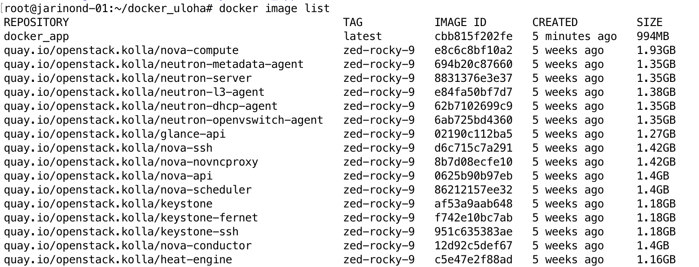

## Analýza obrazu pomocou `docker save`
Vytvoril som tar package: `docker save docker_app > aplikacia.tar` <br>
Rozbalil som package ` tar -xvf aplikacia.tar -C data` a všetky jej podzložky:
```
root@jarinond-01:~/docker_uloha/data# tree -L 3 .
.
├── 2122968229f4ce6b91120529095f31d5423d87e758524e5270ced9d9269a656a
│   ├── VERSION
│   ├── json
│   ├── layer
│   │   ├── bin
│   │   ├── etc
│   │   ├── lib
│   │   ├── opt
│   │   ├── root
│   │   ├── tmp
│   │   ├── usr
│   │   └── var
│   └── layer.tar
├── 459fee03833675655d4068b459d0854055de9e22ce090a1bb394b2286e794cdb
│   ├── VERSION
│   ├── json
│   ├── layer
│   │   └── usr
│   └── layer.tar
├── 6c301727d62f3c8c9cd380198e7690cc1112b964b338d20cdac0b9064a5ee584
│   ├── VERSION
│   ├── json
│   ├── layer
│   │   └── usr
│   └── layer.tar
├── 8792aa27a60beb94c658afc7fb54a4f1c427afe01b65cec0f2261c193ec3f495
│   ├── VERSION
│   ├── json
│   ├── layer
│   │   ├── bin
│   │   ├── dev
│   │   ├── etc
│   │   ├── home
│   │   ├── lib
│   │   ├── media
│   │   ├── mnt
│   │   ├── opt
│   │   ├── proc
│   │   ├── root
│   │   ├── run
│   │   ├── sbin
│   │   ├── srv
│   │   ├── sys
│   │   ├── tmp
│   │   ├── usr
│   │   └── var
│   └── layer.tar
├── ba94024507353491e8c3aa5ae496ab310ddf46d5fbf0e5cd16543ae23a0741ae.json
├── bdd00b24997ff66514ec3882feaca664c922630093e2d29fd7d9a301df5ee4db
│   ├── VERSION
│   ├── json
│   ├── layer
│   │   └── usr
│   └── layer.tar
├── be1936a60abaf8f1d88b0b4b5446c5bb14f2e1dce460cde44bc260d0da40582e
│   ├── VERSION
│   ├── json
│   ├── layer
│   │   └── usr
│   └── layer.tar
├── c458c43d150f4320202902d0f7779988bdd2438801149071af54661b915b75a3
│   ├── VERSION
│   ├── json
│   ├── layer
│   │   ├── etc
│   │   ├── home
│   │   ├── lib
│   │   ├── root
│   │   ├── usr
│   │   └── var
│   └── layer.tar
├── d474937d01f467fa61ee558e1874801e005eb815287f5385b3b431f292f4c519
│   ├── VERSION
│   ├── json
│   ├── layer
│   │   ├── etc
│   │   ├── root
│   │   └── usr
│   └── layer.tar
├── ffa13e093d657c9be4ab2dcd624a5fc4b4e9d148be1b2550693f8d70cde39a7b
│   ├── VERSION
│   ├── json
│   ├── layer
│   │   └── usr
│   └── layer.tar
├── manifest.json
├── repositories
└── –
    └── layer

59 directories, 30 files

```
Príkazom `docker pull` získam obraz `node:17-alpine`. Tento obraz taktiež rozbalím
a všetky jeho podzložky.

Príkazom `diff` ich porovnám:

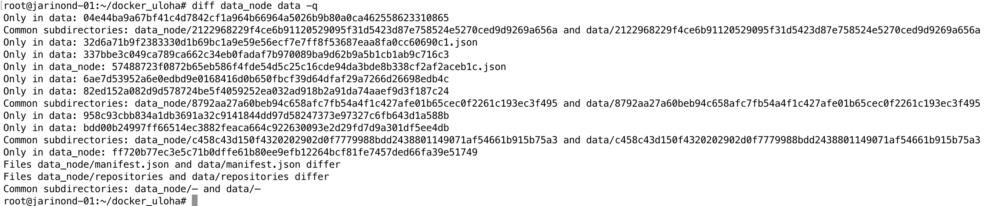

Zložka `data` obsahuje dáta z mojej vytvorenej docker aplikácie (`docker_app`), `data_node` obsahuje dáta základného obrazu `node:17-alpine`.
```
Only in data: 04e44ba9a67bf41c4d7842cf1a964b66964a5026b9b80a0ca462558623310865
Common subdirectories: data_node/2122968229f4ce6b91120529095f31d5423d87e758524e5270ced9d9269a656a and data/2122968229f4ce6b91120529095f31d5423d87e758524e5270ced9d9269a656a
Only in data: 32d6a71b9f2383330d1b69bc1a9e59e56ecf7e7ff8f53687eaa8fa0cc60690c1.json
Only in data: 337bbe3c049ca789ca662c34eb0fadaf7b970089ba9d62b9a5b1cb1ab9c716c3
Only in data_node: 57488723f0872b65eb586f4fde54d5c25c16cde94da3bde8b338cf2af2aceb1c.json
Only in data: 6ae7d53952a6e0edbd9e0168416d0b650fbcf39d64dfaf29a7266d26698edb4c
Only in data: 82ed152a082d9d578724be5f4059252ea032ad918b2a91da74aaef9d3f187c24
Common subdirectories: data_node/8792aa27a60beb94c658afc7fb54a4f1c427afe01b65cec0f2261c193ec3f495 and data/8792aa27a60beb94c658afc7fb54a4f1c427afe01b65cec0f2261c193ec3f495
Only in data: 958c93cbb834a1db3691a32c9141844dd97d58247373e97327c6fb643d1a588b
Only in data: bdd00b24997ff66514ec3882feaca664c922630093e2d29fd7d9a301df5ee4db
Common subdirectories: data_node/c458c43d150f4320202902d0f7779988bdd2438801149071af54661b915b75a3 and data/c458c43d150f4320202902d0f7779988bdd2438801149071af54661b915b75a3
Only in data_node: ff720b77ec3e5c71b0dffe61b80ee9efb12264bcf81fe7457ded66fa39e51749
Files data_node/manifest.json and data/manifest.json differ
Files data_node/repositories and data/repositories differ
Common subdirectories: data_node/– and data/–
```
Vidíme, že v `data` vznikli nové zložky:
- `04e44ba9a67bf41c4d7842cf1a964b66964a5026b9b80a0ca462558623310865`
- `337bbe3c049ca789ca662c34eb0fadaf7b970089ba9d62b9a5b1cb1ab9c716c3`
- `6ae7d53952a6e0edbd9e0168416d0b650fbcf39d64dfaf29a7266d26698edb4c`
- `82ed152a082d9d578724be5f4059252ea032ad918b2a91da74aaef9d3f187c24`
- `958c93cbb834a1db3691a32c9141844dd97d58247373e97327c6fb643d1a588b`
- `bdd00b24997ff66514ec3882feaca664c922630093e2d29fd7d9a301df5ee4db`

A bola odstránená jedna zložka
- `ff720b77ec3e5c71b0dffe61b80ee9efb12264bcf81fe7457ded66fa39e51749`

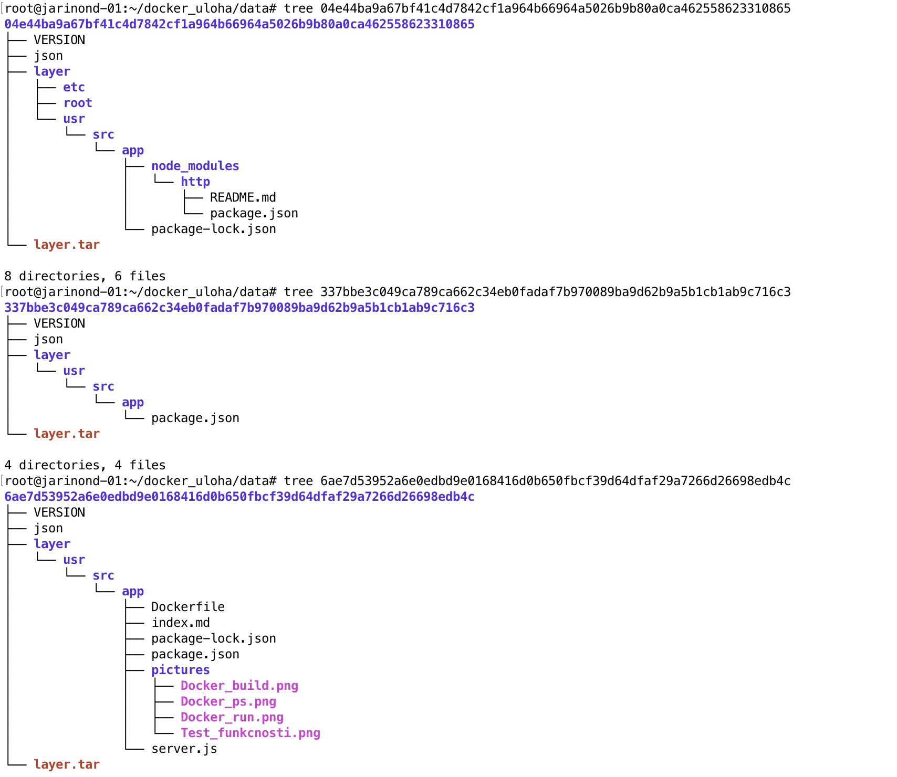
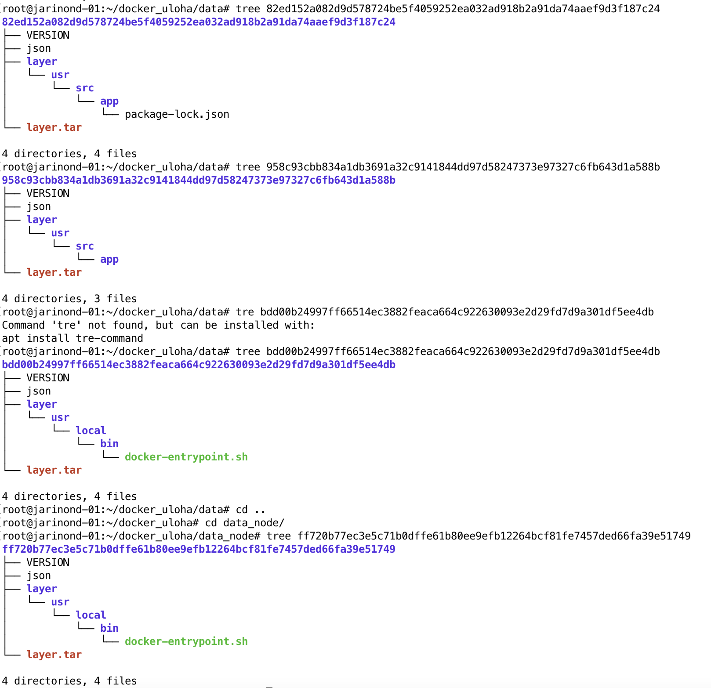

Do zložky `04e44ba9a67bf41c4d7842cf1a964b66964a5026b9b80a0ca462558623310865` sa uložili node modules,
do zložky `337bbe3c049ca789ca662c34eb0fadaf7b970089ba9d62b9a5b1cb1ab9c716c3` sa uložil package-lock.json.

Zložka `6ae7d53952a6e0edbd9e0168416d0b650fbcf39d64dfaf29a7266d26698edb4c` obsahuje samotnú aplikáciu server.js.

Zložka `bdd00b24997ff66514ec3882feaca664c922630093e2d29fd7d9a301df5ee4db` obsahuje `docker-entrypoint.sh`. Tento súbor obsahuje zmeny oproti základnému obrazu, preto je z neho zmazaný.

## Inštalácia systémového kontajnera Arch Linux

Nainštaloval som systemd (`apt install systemd-container`)

Pomocou wget stiahol arch linux bootstrap zo servera `wget http://ftp.sh.cvut.cz/arch/iso/2023.06.01/archlinux-bootstrap-2023.06.01-x86_64.tar.gz`

Rozbalil som tar do zložky ArchLinuxContainer ` sudo tar -xzf archlinux-bootstrap-2023.06.01-x86_64.tar.gz -C ArchLinuxContainer/`

Systemd-nspawn spustí image použitím prepínačov -bD `systemd-nspawn -bD ArchLinuxContainer/root.x86_64`

Na obrázku vidíme spustený arch linux:

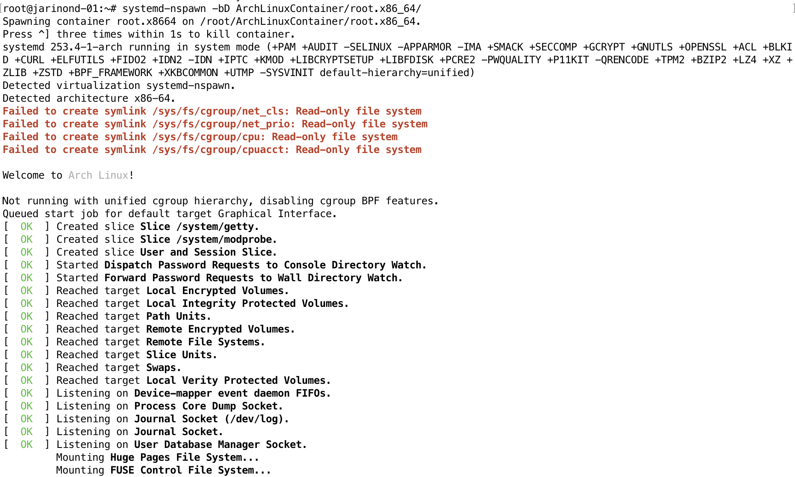

Vytvoril som používateľa root1 a je možné prihlásnie do systému.

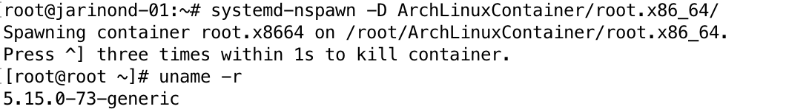


## Jednotkový súbor pre Systemd

Využijem aplikáciu z prvej časti.

Vytvorím unit súbor docker_app.service `touch /etc/systemd/system/docker_app.service`, upravím ho, špecifikujem lokalitu aplikácie `emacs /etc/systemd/system/docker_app.service`.
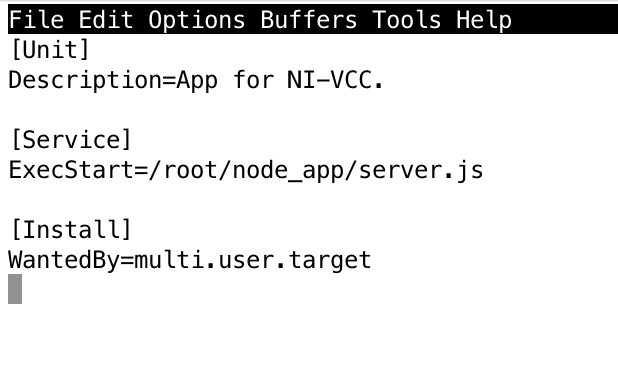

Pomocou `systemd-analyze security docker_app.service` zistíme skóre bezpečnosti.

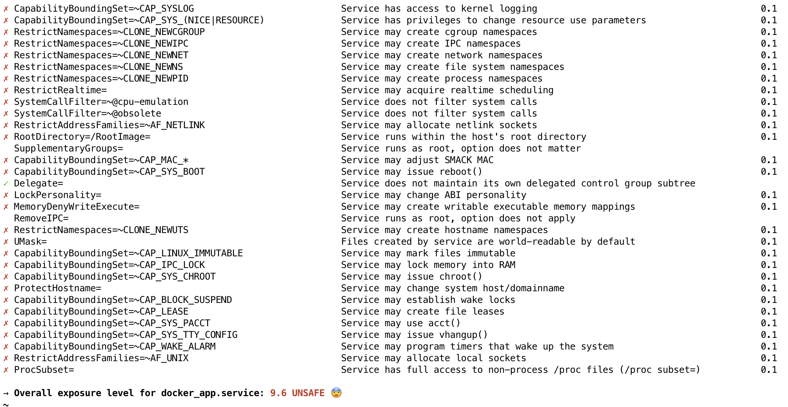
Má 9,6 - Unsafe 😨

Upravím unit file na zlepšenie skóre:
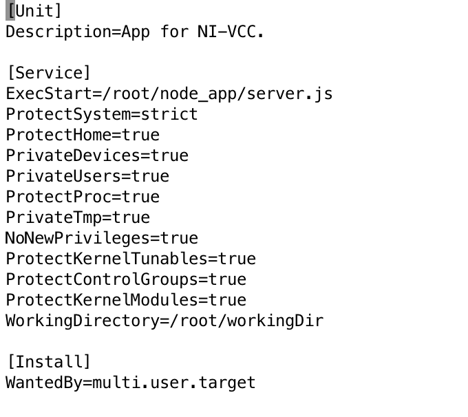


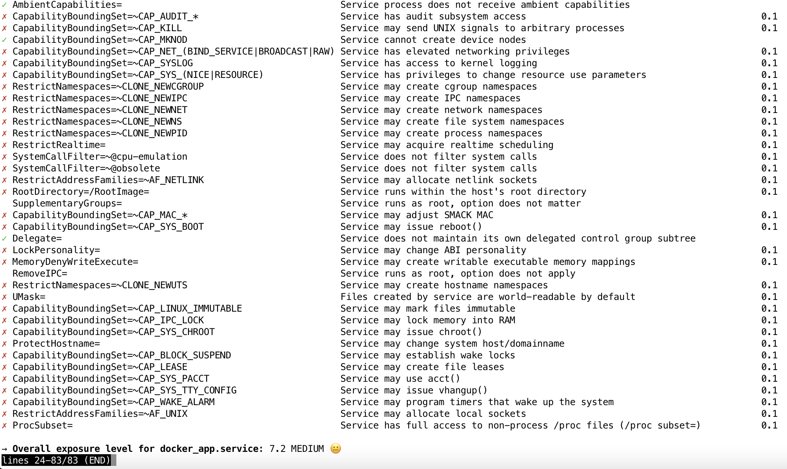
Aplikácia má teraz security score 7.2 MEDIUM 😐
